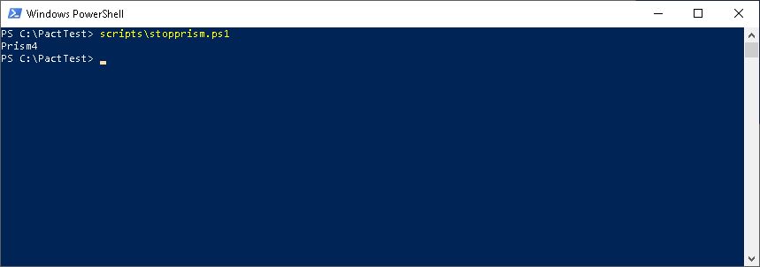

# A Solution to showcase the use of Pact for API Contract Testing for .Net projects

The purpose of this project is to provide a skeletal example of using Pact for .Net projects, specifically .Net 5 and above. This project may work for .Net Core 3 as well but would require a reconfiguration.

Note as well that the functionalities mentioned here were performed on a Windows 10 desktop, although equivalent functions exist for other platforms. 

## Requirements

This project assumes you have the following tools on your environment:

1. Windows 10. Make sure you have applied relevant updates. As mentioned above, slight configuration changes may need to be applied if this were applied to another operating environment.
2. Any Code editor that recognizes and works with C# code:
	1. [VS Code](https://code.visualstudio.com/)
	2. [VsCodium](https://vscodium.com/)
	3. [Visual Studio](https://visualstudio.microsoft.com/)
	4. [JetBrains Rider](https://www.jetbrains.com/rider/)
3. [Dotnet 5](https://dotnet.microsoft.com/download/dotnet/5.0). Note that this may have been installed by your IDE. One quick way would be to launch a Powershell window where you can execute ``dotnet --info``. If this results in an invalid response then it's not yet installed.
4. [Docker Desktop](https://www.docker.com/products/docker-desktop)
5. [PowerShell](https://docs.microsoft.com/en-us/powershell/scripting/overview?view=powershell-7.1). The version that was installed with Windows 10 would be sufficient.

## Introduction

API Contract Testing is a process which ensures that the API Contract matches expectations and implementations. There are, generally, 2 sides to a contract test:

1. Consumer Side 
2. Provider Side

Pact is a contract testing tool initially focused on the consumer. It collects consumer requests which are then executed against the provider. So, the consumer side is the collection of the requests, while the provider side is the validation of the actual API. 

### Why Pact?

Pact is an open source testing framework, generally agnostic of current contract language syntaxes, and as such isn't directly affected when specifications change. While this solution currently works with OpenApi, Pact expectations can eventually be verified against providers that use other syntaxes, such as GraphQl. 

### Consumer Side

A Consumer side view of the contract refers to what a consumer expects of the contract. The term Consumer also refers to the applications that consume the API.

For example, a front-end application may, upon sending a ``GET`` request for the ``User`` object, expect the following fields: ``["userId", "fullName"]``. Another front-end application, upon sending the request, may expect other fields such as ``["userId", "firstName", "lastName", ["contactPreferences"]]``. So, each consumer can then describe what they expect. 

Each consumer can describe their expectations separately. There is a Pact-specific syntax to note them, and while it is possible to manually generate the expectations, Pact provides tooling to simplify this. Using .Net test frameworks (xUnit or nUnit both works, although this solution uses xUnit) provide the functionality to describe those expectations in code, which, upon successful validation, will generate the Pact file. 

### Provider Side

A provider side view of the contract refers to what the actual API endpoint returns. It usually refers as well to the completed API, although, as described here, we will be mocking this as a way of validating the generated contract against the expectations

## Workflow 

{height=200}

Here we recommend a workflow which can be followed to generate functional and accurate APIs.
1. Generate consumer expectations 
2. Save expectations in an accessible location
3. **Optional** - Send expectations to the Pact Broker
4. Generate the specifications based on expectations 
4. Initiate a mock server based on the specifications
5. Validate the expectations against the mock server implementation
6. Upon completion of the actual API, validate the expectations against it

### Generate Consumer Expectations

This solution will be using an xUnit project to aid in the generation of the Pact File. follow the section ["Steps to execute current test"](#steps-to-execute-current-test) to generate this file. Note that you can create as many tests as needed, and furthermore, many client expectations can be generated separately. 

#### Steps to execute current test
1. Go into the tests/consumer.tests folder
	``cd ./tests/consumer.tests``
2. Rebuild the project
	``dotnet build``
3. Run the tests
	``dotnet test``

	
4. If the tests are successful, the pact file will be generated. Go into the pacts folder to view the generated JSON file
	``cd ../../pacts``
5. There will be a file called ``consumer1-testapi1.json`` which is the Pact file generated if the test was successful

#### Steps to write your own test
1. create new xUnit test project 
		``dotnet new xunit``
2. add PactNet (replace .Windows with something else if this is being implemented on a different platform)
		``dotnet add package pactnet.windows``
3. add a mock fixture: see [PactMock.cs](./tests/consumer.tests/PactMock.cs)
4. add an API Client: see [ApiClient.cs](./tests/consumer.tests/ApiClient.cs)
5. add your tests: see [Consumer1Tests.cs]((./tests/consumer.tests/Consumer1Tests.cs))
6. run your tests 
		``dotnet test``
7. locate your pacts folder and view the generated pact file in JSON format

### Save expectations in an accessible location

Once the tests are successfully executed, a Pact file will be generated. For the purpose of this solution, it is stored inside the [``./pacts``](./pacts/) folder. This can serve as the location for the providers to view this as well. 

CI/CD pipelines can also automate the transfer of the Pact file to a location not related to this project, which ensures its visibility and accessibility for automation tasks.

### **Optional** - Send expectations to the Pact Broker

Another option would be to store these pacts using a Pact broker.

#### Set up the Pact Broker

There are 2 options to implement the Pact Broker -- using a cloud-hosted one or instantiating the broker locally.

[PactFlow](https://pactflow.io) is a cloud-based service which offers this functionality. 

A local copy of the Pact broker can also be instantiated. It requires a Postgres database for storage. The documentation [here](https://docs.pact.io/pact_broker/docker_images/pactfoundation/) provides ample information and guidance. A Docker compose file is also provided [here](https://github.com/pact-foundation/pact-broker-docker/blob/master/docker-compose.yml) which include a Postgres instance for experimental use. The steps to start and stop this version is included below.

A PowerShell script is included to start Pact Broker. To start this, from the root of this project, type in the following command in a Powershell window:
		``.\scripts\StartPactBroker.ps1``

An output similar to the one below will be displayed:

This will start the Pact Broker. Head on to ``http://localhost:9292`` to access the application. The UI will look like this:

To stop the broker, start another PowerShell window, and type in the following command at the root of this project:
		``.\scripts\StopPactBroker.ps1``

An output similar to the one below will be displayed:

Once a Pact broker has been enabled, the pact file can then be pushed into its repository.

#### Send Expectations to the Broker

A Powershell script is included here to send the default pact file to the locally hosted broker. To execute this, launch a Powershell console, and on the project root folder, type in: 
		``scripts\ImportPactToBroker.ps1``

A similar output is displayed below:

When that is complete, launch a browser to the broker URL (i.e. ``http://localhost:9292``)

Note that the ``Last Verified`` column is empty for the newly imported Pact.

As new versions are generated, the same script can be executed to send in the appropriate version tag, as such:
		``scripts\ImportPactToBroker.ps1 -version 1.0.1``

where ``1.0.1`` can be replaced with any appropriate version. 

As well, after the tests are complete, these pacts can also be removed from the broker. to launch the script to remove the pact,  launch a Powershell console, and on the project root folder, type in: 
		``scripts\DeletePactFromBroker.ps1``

### Generate the Specifications based on Expectations 

There are a number of options to generate the specifications. As this solution is focused primarily on OpenApi (or Swagger), cloud services such as [Swagger Hub](https://swagger.io/tools/swaggerhub/) provide an integrated experience to managing the lifecycle of this document. 

A local-based approach would be to use the [OpenAPI extension](https://marketplace.visualstudio.com/items?itemName=42Crunch.vscode-openapi) for [VS Code](https://code.visualstudio.com/) or [VS Codium](https://vscodium.com/). 

Another approach could be the use of the Swagger Editor, which is available either on the [cloud](https://github.com/swagger-api/swagger-editor) or [locally](https://github.com/swagger-api/swagger-editor) with a choice of NodeJs or Docker.

Regardless of the method, The resulting file can be in either Yaml or Json formats. 

A generated yaml file is included in this solution, under ``./OpenApi``.

### Initiate a mock server based on the specifications

Mock servers short-circuit the development process by allowing consumers to start writing their applications and connecting to a "fake" endpoint. However, before consumer app developers start working on their apps, the contract must first be verified to match the consumer expectations. This allows the mock server to perform double duty -- first, as an endpoint for the expectations to be verified against, and when successful, as the endpoint for consumer app developers.

In the solution we will use a mock server called [Prism](https://github.com/stoplightio/prism). This is an open-source project provided by [Stoplight](https://stoplight.io).

While this server can be started using NodeJs, this project will instead take the Docker route, to reduce the need for additional software.

A PowerShell script is included to start the Prism with the default ``yml`` file. To start this, from the root of this project, type in the following command in a Powershell window:
		``.\scripts\Startprism.ps1``

A similar output is displayed below:

This will start Prism in interactive mode. tests can now be initiated against the default endpoint (i.e. ``http://localhost:4010``)

To stop Prism, start another PowerShell window, and type in the following command at the root of this project:
``.\scripts\Stopprism.ps1``

A similar output is displayed below:

### Validate the expectations against the mock server implementation

This solution will be using an xUnit project to verify the expectations in the generated Pact file are verified in the target API. Rather than implement the actual code for the API, we will use the mock server in its place as a first step in verifying our contract. follow the section ["Steps to verify Pact expectations"](#steps-to-verify-pact-expectations) to complete this process. 
#### Steps to execute current test against the pact file
1. go into the tests/provider.tests folder
	``cd ./tests/provider.tests``
2. rebuild the project
	``dotnet build``
3. run the tests
	``dotnet test``
	
4. if the tests are successful, then the Pact files are verified.

#### Steps to execute current test against the pact broker
1. go into the tests/provider.tests folder
	``cd ./tests/provider-withBroker.tests``
2. rebuild the project
	``dotnet build``
3. run the tests
	``dotnet test``
4. if the tests are successful, then the Pact files are verified.
	
5. launch the browser, and go to the default pact broker URL. Note that the ``Last Verified`` column is now filled.
	

### Upon completion of the actual API, validate the expectations against it

Follow the steps above in the section ["Steps to verify Pact expectations"](#steps-to-verify-pact-expectations), only this time, change the endpoint to match the API. 